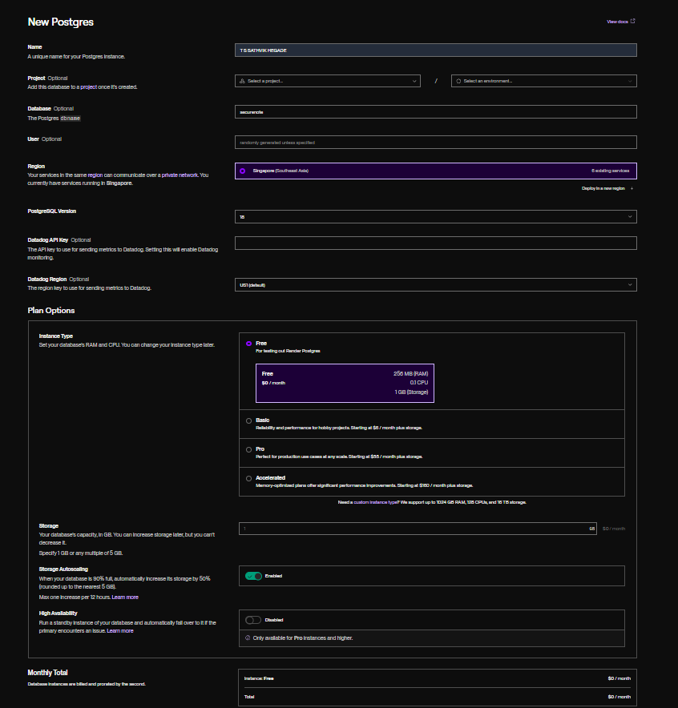
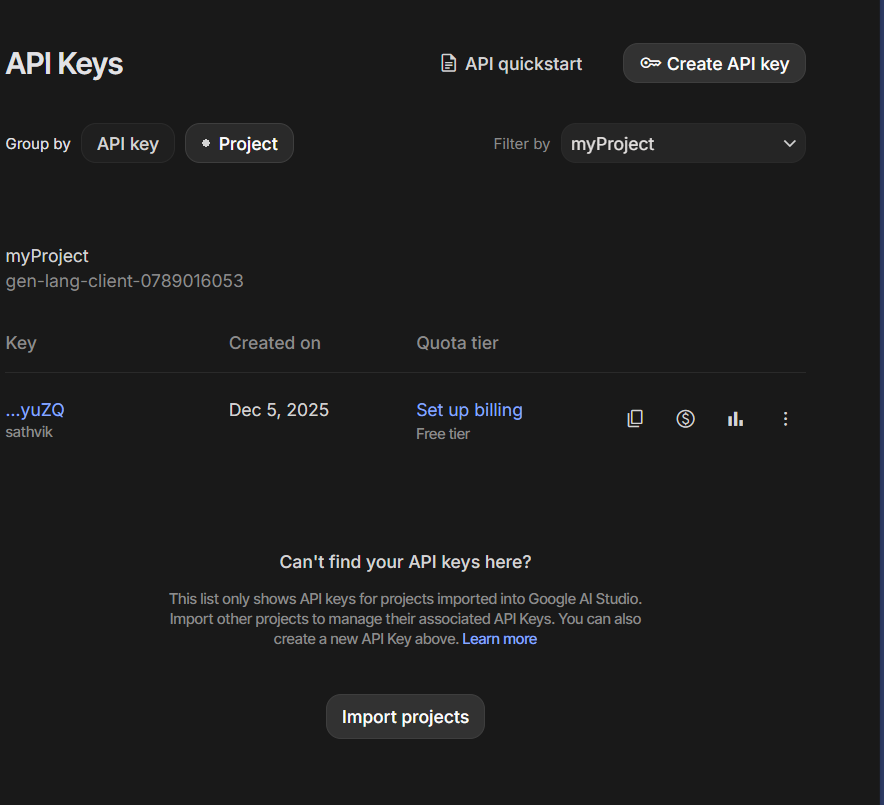
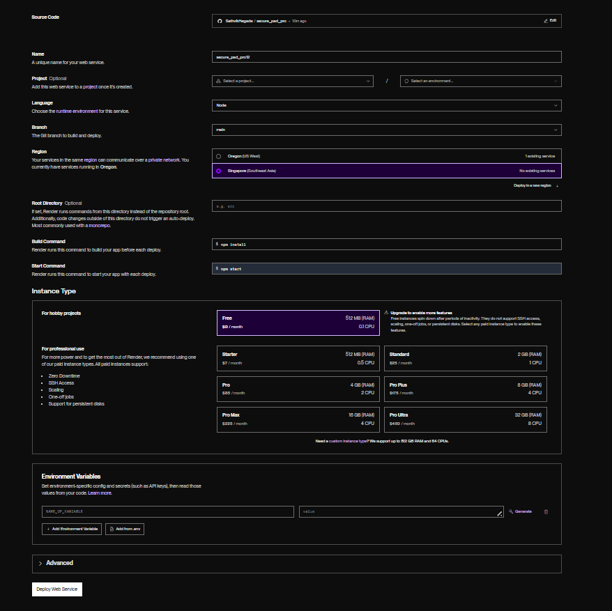
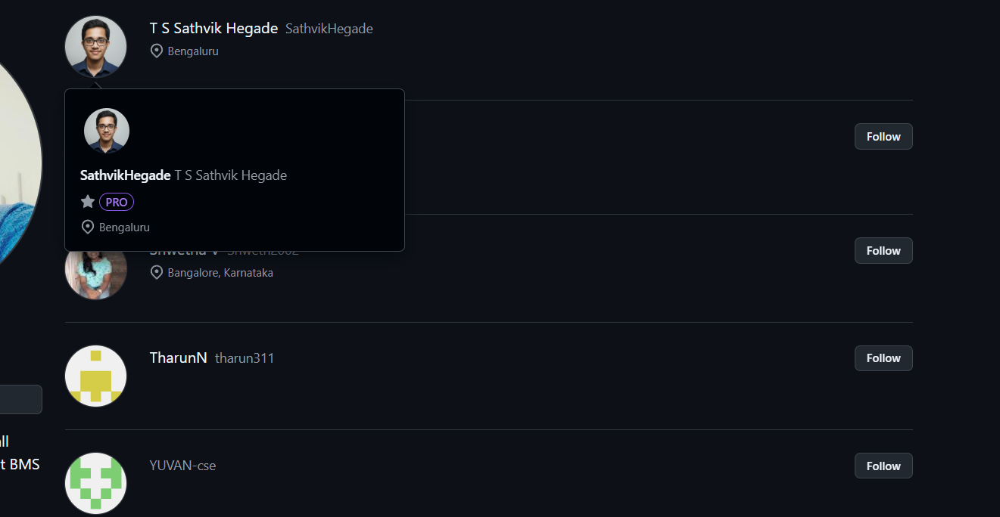
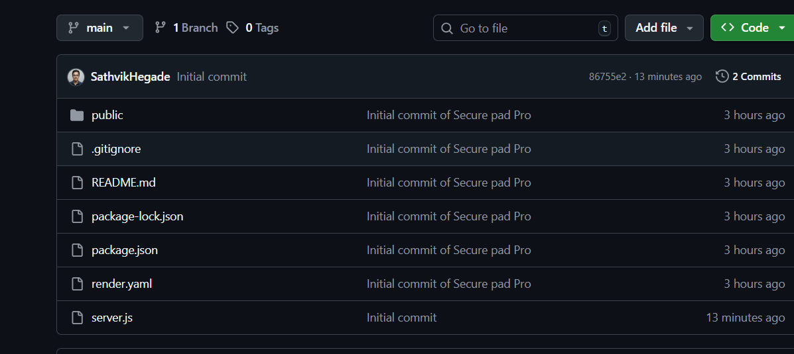

# SecureNote

A secure note-taking platform with AI summaries, Cloudinary uploads, and auto-expiring private notes.

    

**Live Demo:** https://secure-pad-pro-15.onrender.com

## Table of Contents
[Features at a Glance](#features-at-a-glance) · [Quick Start](#quick-start) · [Tech Stack](#tech-stack) · [Architecture](#architecture) · [Screenshots](#screenshots) · [Documentation](#documentation) · [Deployment](#deployment) · [Key Endpoints](#key-endpoints) · [Testing & Monitoring](#testing--monitoring) · [Usage Tips](#usage-tips) · [Maintainer](#maintainer) · [About Me](#about-me) · [Roadmap](#roadmap)
## Features at a Glance

- Custom URLs with public or bcrypt-protected private notes.
- Auto-save every two seconds; public notes auto-delete after chosen duration (1h-7d), private notes persist indefinitely.
- Google Gemini summaries with document-level insights.
- Cloudinary uploads (PDF, JPG, PNG, DOCX up to 10 MB).
- Responsive UI, dark mode, and security logging backed by PostgreSQL.

## Quick Start

```bash
npm install
cp .env.example .env   # fill PORT, DATABASE_URL, GEMINI_API_KEY, CLOUDINARY_*
npm start               # or npm run dev
```

## Tech Stack

- Node.js · Express · PostgreSQL · Cloudinary · bcrypt.
- Frontend: HTML5, CSS3, vanilla JavaScript.
- AI: Google Gemini 2.5 Flash (@google/generative-ai).

## Architecture

- Browser: index.html (create/access), pad.html (editor).
- API: server.js for auth, content, uploads, AI, and cleanup jobs.
- Data: PostgreSQL tables (pads, files, security_logs) plus Cloudinary CDN.

## Screenshots







## Documentation

- docs/SETUP.md – local setup & environment.
- docs/API.md – endpoint reference.
- docs/SECURITY.md – authentication & hardening.
- docs/DB_SCHEMA.md – PostgreSQL schema.
- docs/DEPLOY.md – Render/Railway guides.
- docs/TROUBLESHOOTING.md – common fixes.

## Deployment

- Deploy-ready on Render or Railway using render.yaml.
- Requires DATABASE_URL, GEMINI_API_KEY, and Cloudinary credentials.
- Health-check endpoint: GET https://your-app.onrender.com/health.

## Key Endpoints

- `POST /api/create-pad` – create a public or private note.
- `POST /api/login` – authenticate (skips password for public notes).
- `POST /api/pad/:padId/save` – persist content and reset the auto-delete timer.
- `POST /api/pad/:padId/retention` – adjust the auto-delete window for a pad.
- `POST /api/upload/:padId` – upload attachments to Cloudinary.
- `POST /api/summarize/:padId` – request a Gemini summary.

## Testing & Monitoring

- Run `npm test` (when available) or manual smoke tests after deployment.
- Verify auto-delete by editing a note and checking database timestamps.
- Configure uptime pings against `/health` every five minutes.
- Enable PostgreSQL backups and Cloudinary usage alerts.

## Usage Tips

- Bookmark your note URL; private notes require the matching password.
- For public notes, leave the password field empty on the access form.
- **Private notes never auto-delete**—content and files persist indefinitely.
- **Public notes** can adjust the auto-delete timer (1 hour to 7 days) in the editor.
- Re-save content after major edits to restart the retention countdown (public notes only).
- Use dark mode before lengthy writing sessions to reduce eye strain.
- Upload optimized PDFs or images under 10 MB for faster load times.

## Maintainer

T S Sathvik Hegade · sathvikhegade3@gmail.com · MIT License

## About Me

- Engineering student at BMS Institute of Technology and Management.
- Skilled in Machine Learning, Deep Learning, C++, Python, and full-stack web development.
- Passionate about building secure, user-friendly productivity tools.

## Roadmap

- Multi-factor authentication for private notes.
- Markdown editing experience with export options.
- Collaboration mode with real-time presence and history.
- Native mobile shell for quick capture on Android/iOS.


Built by Sathvik Hegade.
